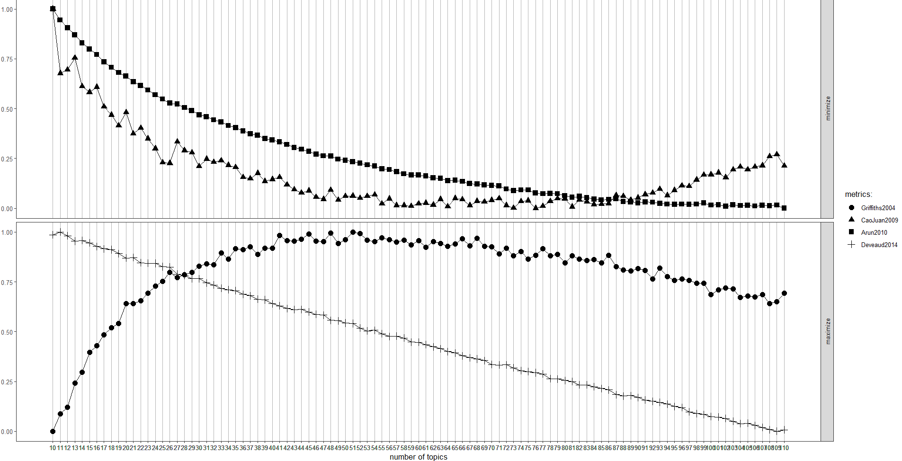
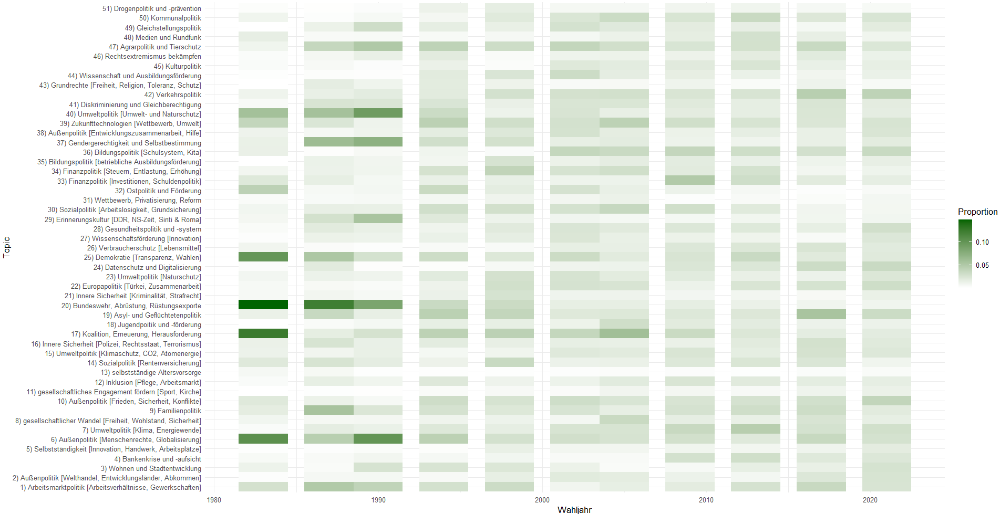

# Manifesto Topic Modeling with R

This repository contains a **Digital Humanities** project applying quantitative computational methods to a political science research question. Using **topic modeling**, I analyzed party manifestos from the **Manifesto Project** database for German parties. The goal is to track thematic patterns over time and compare how the parties' political priorities have evolved.

The analysis is implemented in R and follows a standard text-mining pipeline: data retrieval, preprocessing, POS-based filtering, document-term matrix creation, LDA topic modeling, and visualization of topic proportions by election year and party.


## Research context and Objectives

The dataset is sourced from the [Manifesto Project database](https://manifesto-project.wzb.eu). The analysis focuses on the manifestos published between **1983 and 2021** of three major parties: **SPD** (41320), **FDP** (41420) and **Bündnis 90/Die Grünen** (41111, 41112, 41113). Notably, these three parties went on to form Germany's federal coalition government following the 2021 general election.

The project investigates:

- which latent topics can be derived from the manifestos using an unsupervised LDA model,
- how the salience of topics differs or aligns between SPD, FDP, and the Greens,
- how topical emphasis shifts across election cycles.

## Prerequisites

Before running the scripts, make sure the following are available:

### R and packages

Install R (preferably recent version) and the required packages:

```r
install.packages(c(
  "manifestoR",
  "dplyr",
  "tidytext",
  "quanteda",
  "udpipe",
  "topicmodels",
  "LDAvis",
  "tsne",
  "reshape2",
  "ggplot2",
  "ldatuning",
  "tidyverse"
))
```

### Manifesto Project API key

You need a valid Manifesto Project API key stored in a text file named [`manifesto_apikey.txt`](other_docs/manifesto_apikey.txt).


### Additional stopword files

The preprocessing relies on the removal of German stopwords and, during the process defined, overused terms. The according files can be found in the [`other_docs`](other_docs) folder:

- [`stopwords_deutsch.txt`](other_docs/stopwords_deutsch.txt)
- [`topwords_deutsch.txt`](other_docs/topwords_deutsch.txt)

The scripts currently point to absolute Windows paths and may need to be adjusted on another machine.


## Workflow

You can find all named files in the [`R_scripts`](R_scripts) folder

### 1. Corpus preparation

The file [`1_Prepare_Corpus.R`](R_scripts/1_Prepare_Corpus.R):

- downloads the selected party manifestos filtered by ID and date range with the personal API key,
- splits long texts into chunks,
- creates a tidy dataframe with one section per row.

### 2. POS tagging and lemmatization

The file [`2_POS-Tagging.R`](R_scripts/2_POS-Tagging.R):

- downloads the German UDPipe language model,
- tags each text chunk to keep nouns and proper nouns,
- replaces special characters and normalizes the nouns,
- stores inflected word variants into single lemma-based noun terms.

**The motivation is to reduce noisy text and vocabulary sparsity as well as to keep conceptually relevant terms.**

### 3. DTM creation

The file [`3_DTM.R`](R_scripts/3_DTM.R):

- converts the prepared data to a `quanteda` corpus,
- removes German stopwords and self-defined topwords (semantically irrelevant),
- identifies frequent collocations and compounds them into multi-word phrases,
- creates a document-term matrix,
- removes empty rows and sparse non-representative terms.


### 4. Topic modeling

The file [`4_Topic_Modelling.R`](R_scripts/4_Topic_Modelling.R):

- sets the topic number (to determine `K`, see step 6),
- runs an LDA model with Gibbs sampling,
- calculates topic distributions (`theta`) and term distributions (`beta`),
- derives topic labels from the top terms,
- exports JSON for LDAvis-based interactive exploration.

### 5. Visualization of party-specific topic distributions

The file [`5_Viz_Heatmap_PartyDistributions.R`](R_scripts/5_Viz_Heatmap_PartyDistributions.R):

- loads the labels that I manually created for each topic based on the [top 20 terms](results/Top20Terms.txt),
- aggregates topic proportions by election year for each party,
- creates party-specific heatmaps,
- saves topic terms and labels to [`results/`](results).


### 6. Topic number selection

The file [`CalculateTopicNumber.R`](R_scripts/CalculateTopicNumber.R) uses the DTM (step 3) and the `ldatuning` package to visually determine an appropriate number of latent topics (`K`). Using several metrics we can identify the optimal `K` where divergence metrics are minimized and coherence metrics are maximized.




## How to run the project

1. Place your Manifesto Project API key in the path expected by the script.
2. Adjust absolute file paths in the scripts if you are running the project outside the original setup.
3. Run the scripts in order:

```r
source("R_scripts/1_Prepare_Corpus.R")
source("R_scripts/2_POS-Tagging.R")
source("R_scripts/3_DTM.R")
# source("R_scripts/CalculateTopicNumber.R")  # optional tuning step
source("R_scripts/4_Topic_Modelling.R")
source("R_scripts/5_Viz_Heatmap_PartyDistributions.R")
```

### Output files

The project produces several result artifacts:

- [`results/TopicLabels.txt`](results/TopicLabels.txt) — manually assigned labels for each topic
- [`results/Top20Terms.txt`](results/Top20Terms.txt) — top 20 terms for each topic
- `workspaces/*.RData` — saved workspace objects from the pipeline


## Project Findings and Limitations

### Macro-Level Historical Trends (1983–2021):

- **1980s (Peace & Ecology)**: Cold War foreign policy and disarmament (topics 6, 10, 20), and early environmental policy (topic 15) influenced by Chernobyl and the West German peace movement [[1]](#1).
- **1990 (Reunification)**: Heavy focus across all parties on German reunification and the East Germany integration (topics 3, 29, 32).
- **1998–2009 (Europe & Economic Crises)**: Increased prevalence of European integration (topic 22), which converged with debt policies and banking regulation (topics 4, 33) after the 2009 Eurozone crisis.
- **2013 to 2021**: Sharp increase in topics surrounding digitalization / data privacy (topic 24), asylum/refugee policy (topic 19), and climate-driven transport policies (topics 7, 15, 42). In 2021, scientific research funding and health policy (topics 27, 28) spiked in response to COVID-19.
- **Constant Anchors**: Labor market conditions, foreign conflict resolution and tax/financial policy (topics 1, 10, 34) remained persistent across all 11 election cycles.


### Party-Specific Evolutions

<u>**SPD**</u> [[2]](#2):
- **Core**: Focuses on labor market, social and financial policy (Topics 1, 14, 34).
- **Post-1989**: Shifted toward post-materialist values like peace, environmental protection (Topics 7, 47), and self-determination (Topic 37).
- **2017–2021**: Increased focus on digitalization, asylum, and transport (Topics 19, 24, 42), presenting itself as a broad catch-all party (Volkspartei).


<u>**Bündnis 90/Die Grünen**</u> [[3]](#3):

- **1983–1990**: Centered on foreign policy/human rights (Topic 6), disarmament (Topic 20), democracy (Topic 25), and ecology (Topic 40).
- **1987 Onward**: Expanded into gender equality (Topics 37, 49), anti-discrimination (Topic 41), and remembrance culture (Topic 29).
- **1990s**: Linked ecology with finance (Topic 34) and social policy (Topics 14, 30) for their 1998 ecological tax reform.
- **Post-2000s**: Broadened into a reform party covering education (Topic 36), youth/science (Topics 18, 39, 44), energy efficiency (Topics 7, 15), and EU policy (Topic 22).




<u>**FDP**</u> [[4]](#4):

- **Longitudinal Core**: Focused consistently on market competition, privatization, and administrative reform (Topic 31).
- **1983–1998**: Emphasized foreign policy, basic rights, labor, and cultural policy (Topic 45).
- **2017–2021**: Refocused on digitalization/data privacy (Topic 24) and education (Topic 36).


### Methodological & Technical Limitations

**Core Methodological Takeaways**
- **Scale Dependency**: LDA efficiency increases with larger text corpora; expanding the time horizon or including additional political parties yields cleaner topic distributions.
- **Topics vs. Stances**: LDA clusters by word co-occurence patterns, but cannot infer political sentiment or ideological stance. Quantitative extraction must be paired with qualitative evaluation. This means that topics should be interpreted as analytical frames (perspectives) rather than exhaustive representations of complex policy issues [[5]](#5).
- **Validation Overhead**: Model evaluation remains a manual, human-intensive work requiring domain expertise to filter noise and assign accurate topic labels.

**Systemic Technical Challenges**
- **Semantic Drift (Word Shifts)**: Words alter contextual meaning over a 40-year window due to real-world events, introducing minor noise into longitudinal topic trajectories.
- **Length Bias**: Parties expressing policy positions concisely are mathematically less likely to dominate topic distributions compared to those with verbose descriptions.


### References
<a id="1">[1]</a>
Andreas Buro, "Friedensbewegung" [Peace Movement], in Handbuch Frieden, ed. Hans-Joachim Gießmann and Bernhard Rinke (Wiesbaden: VS Verlag für Sozialwissenschaften, 2011), 113–124.

<a id="2">[2]</a>
Tim Spier and Ulrich von Alemann, "Die Sozialdemokratische Partei Deutschlands (SPD)", in *Handbuch Parteienforschung*, ed. Oskar Niedermayer (Wiesbaden: Springer Fachmedien, 2013), 445.

<a id="3">[3]</a>
Lothar Probst, "Bündnis 90/Die Grünen (GRÜNE)," in *Handbuch Parteienforschung*, ed. Oskar Niedermayer (Wiesbaden: Springer Fachmedien, 2013), 509–540.

<a id="4">[4]</a>
Hans Vorländer, "Die Freie Demokratische Partei (FDP)," *in Handbuch Parteienforschung*, ed. Oskar Niedermayer (Wiesbaden: Springer Fachmedien, 2013), 497–507.

<a id="5">[5]</a>
Paul DiMaggio, Manish Nag, and David Blei, "Exploiting Affinities Between Topic Modeling and the Sociological Perspective on Culture: Application to Newspaper Coverage of U.S. Government Arts Funding," Poetics 41, no. 6 (2013): 570–606.